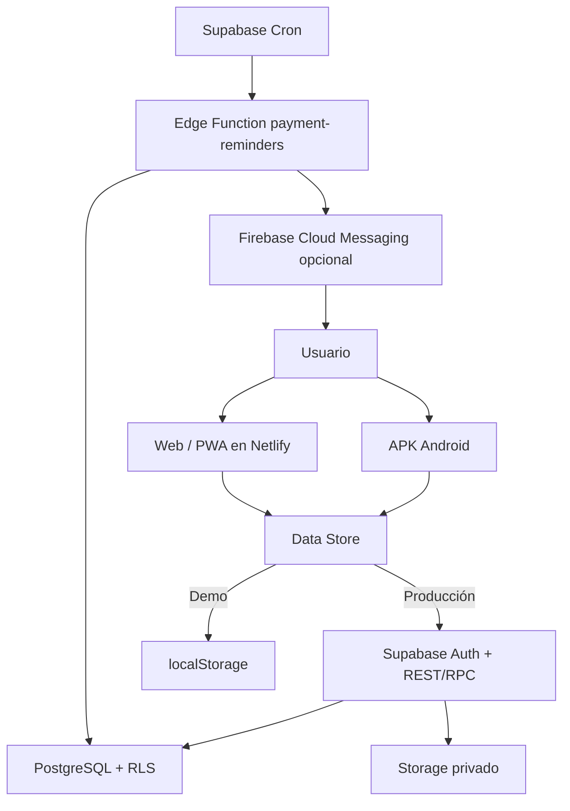
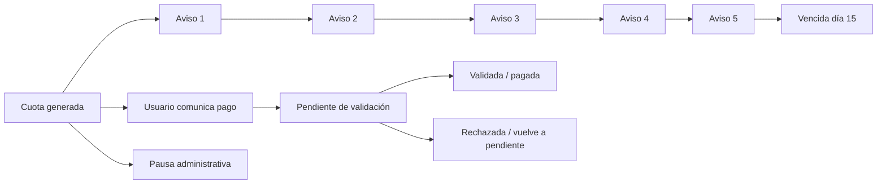

# Arquitectura · Urban Warriors 1.2

## Capas

## Cuenta, persona y alumno

La cuenta autenticada no se confunde con el alumno. Un adulto puede ser tutor, alumno y miembro del equipo a la vez. Los menores quedan vinculados a uno o varios tutores.

## Ciclo de mensualidad

Reglas principales:

- Calendario inicial: 1, 4, 8, 11 y 14.
- La combinación cuota, destinatario, número de aviso y canal es única.
- Los hermanos se pueden agrupar en un único mensaje, manteniendo una fila histórica por cuota.
- Un pago comunicado detiene los avisos hasta su revisión.
- Dirección, secretaría y tesorería pueden registrar cobros, pausar, reactivar, validar o rechazar.
- Una pausa con fecha final caduca automáticamente.

## Migraciones

- `001`: núcleo multi-club y RLS.
- `002`: cuentas, accesos, publicaciones, material y notificaciones.
- `003`: estados `pendiente_validacion` y `aplazada`.
- `004`: cinco avisos, justificantes privados, cobros, pausas, historial y RPC.
