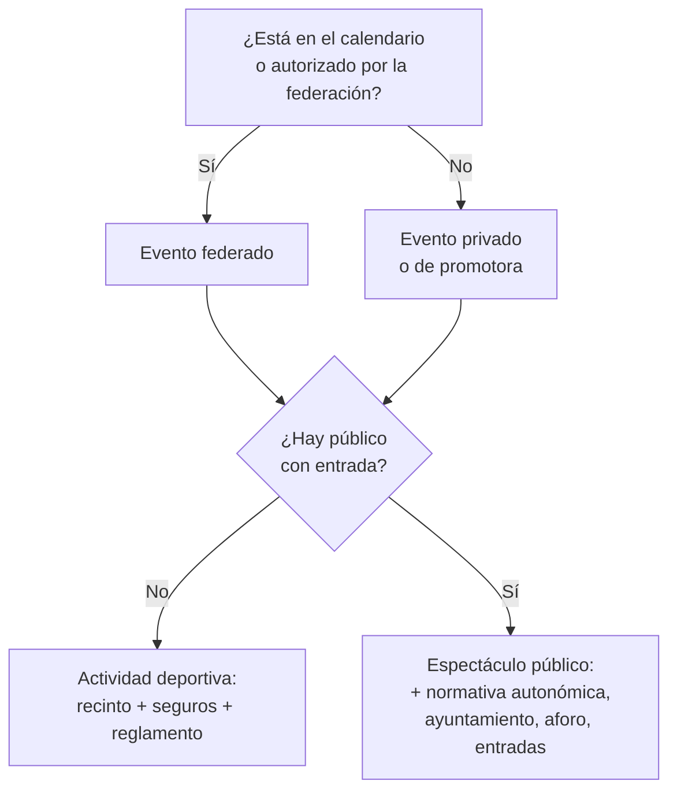

# Clasificar y planificar un evento de deportes de contacto

*Antes de alquilar el pabellón o anunciar el cartel, averigua qué estás organizando. De eso depende todo lo demás.*

## Antes de empezar (versión rápida)

- **No existe una autorización universal para "un evento de contacto".** Lo que necesitas depende de seis variables: oficialidad, público, recinto, menores, dinero y extranjeros. **[Recomendación KOMBAX]**
- **La federación decide si tu evento es oficial**, no el cartel. Si quieres árbitros oficiales, licencias y seguro federativo, habla con ella primero (A3). **[Requisito federativo]**
- **Si hay público, entra en juego la normativa autonómica de espectáculos públicos** y las condiciones del ayuntamiento y del recinto (C3). **[Obligación legal]** / **[Recinto / municipio]**
- **Empieza con tiempo.** Muchos trámites municipales y federativos piden semanas. **[Recomendación KOMBAX]**: planifica desde T-90 (90 días antes).

## 1. Qué resuelve esta guía

Esta es la guía central del itinerario "El evento". Te ayuda a clasificar tu actividad, a identificar qué guías y qué trámites aplican y a montar un cronograma. Las demás guías C desarrollan cada pieza.

## 2. A quién va dirigida

Clubes que organizan su primera velada, promotores, federaciones que autorizan eventos y ayuntamientos que quieren entender lo que se les pide.

## 3. La decisión que tienes que tomar

**¿Qué tipo de evento es el tuyo?** Responde a estas seis preguntas y apunta las respuestas en el expediente (D1).

| Pregunta | Opciones | Qué activa |
| --- | --- | --- |
| 1. ¿Es oficial? | Oficial federado / autorizado por la federación / privado / entrenamiento | A3, A4, B3 (seguro de licencia), C4 |
| 2. ¿Hay público? | Sin público / invitados / público con entrada | C3 (espectáculos, aforo, autoprotección), C6 |
| 3. ¿Dónde? | Instalación propia / pabellón municipal / recinto privado / aire libre | C3 |
| 4. ¿Participan menores? | Sí / no | B1, B2, C4, C5 |
| 5. ¿Se mueve dinero? | Entradas, inscripciones, bolsas, patrocinio | A2, C6, C8, A5 |
| 6. ¿Hay extranjeros? | Deportistas, árbitros o técnicos | C7 |

## 4. Cuatro tipos de evento

- **Federado sin público** (un open o un interclub a puerta cerrada): la clave es la federación, los seguros y el recinto.
- **Federado con público** (campeonato con taquilla): se suman la normativa de espectáculos, el aforo, la seguridad y el ticketing.
- **Privado sin público** (sparring abierto entre clubes): cuidado con los seguros; las licencias pueden no cubrirlo (B3).
- **Privado con público** (velada de promotora): es el caso más exigente, porque no te ampara la estructura federativa y te afecta toda la normativa de espectáculos.

## 5. El marco que se aplica

| Norma | Qué establece | Nivel |
| --- | --- | --- |
| **Ley 39/2022 del Deporte** | Competiciones oficiales de ámbito estatal; oficialidad por inclusión en calendarios federativos | [Obligación legal] |
| **Normativa autonómica de espectáculos públicos y actividades recreativas** | Licencias, autorizaciones o comunicaciones previas para espectáculos, requisitos de seguridad, seguros de RC, horarios | [Obligación legal] — ficha T |
| **Ordenanzas municipales y condiciones del recinto** | Cesión de instalaciones, aforos, horarios, fianzas, seguros | [Recinto / municipio] |
| **Autoprotección y emergencias** | El RD 393/2007 quedó derogado con efectos de 11/07/2023 por el RD 524/2023. No uses sus antiguos umbrales como regla estatal vigente. La obligación concreta debe comprobarse en la normativa autonómica, local, del recinto y en las exigencias del órgano que autoriza la actividad | [Obligación legal] cuando resulte aplicable — verificar en C3 y ficha territorial |
| **Ley 19/2007 y RD 203/2010** | Prevención de la violencia en competiciones deportivas **oficiales de ámbito estatal** organizadas en el marco federativo | [Obligación legal] solo en ese ámbito |
| **TRLGDCU (consumidores)** | Si vendes entradas a consumidores (C6) | [Obligación legal] |
| **Reglamentos federativos** | Reglas, categorías, arbitraje, asistencia médica (C4, C5) | [Requisito federativo] |

> **Nota sobre la Ley 19/2007.** R90 la citaba en varias guías como si afectara a cualquier velada. Su ámbito son las competiciones oficiales de ámbito estatal organizadas en el marco federativo. Una velada amateur autonómica o privada no entra, en principio, en ese régimen, aunque la normativa autonómica de espectáculos puede exigir medidas de seguridad parecidas.

## 6. Cronograma orientativo

*Plantilla de trabajo KOMBAX. Los plazos son orientativos: los reales dependen del ayuntamiento, de la comunidad y de la federación.*

| Momento | Tarea | Guía |
| --- | --- | --- |
| T-120 / T-90 | Clasificar el evento; consultar a la federación; reservar provisionalmente el recinto; primer presupuesto | C1, A3, C3 |
| T-90 | Preguntar al ayuntamiento qué régimen aplica (licencia, autorización, comunicación) y con qué plazo | C3, ficha T |
| T-75 | Pedir presupuestos de seguros; revisar las condiciones del recinto | B3, C3 |
| T-60 | Presentar las solicitudes municipales y autonómicas; solicitar la autorización federativa | C3, A3 |
| T-60 | Si hay extranjeros no UE: iniciar la revisión de entrada y trabajo | C7 |
| T-45 | Abrir la venta de entradas con condiciones completas | C6 |
| T-45 | Contratar asistencia sanitaria y seguridad | C5, C3 |
| T-30 | Cerrar el cartel provisional; verificar licencias y documentación médica | C4, A4, C5 |
| T-14 | Plan de autoprotección o de seguridad, si procede; reunión con el recinto | C3 |
| T-7 | Checklist final; certificados de seguros; lista de personal y de acreditaciones | D1, B3 |
| T-1 | Pesaje y reconocimientos | C4, C5 |
| Día D | Apertura con checklist, registro de incidencias | D1 |
| T+1 a T+30 | Cierre económico, siniestros, resultados, datos | D2 |

## 7. Presupuesto: partidas que se olvidan

Seguros específicos (B3), servicio médico y ambulancia (C5), árbitros y jueces, pesaje, seguridad y control de acceso, limpieza, tasas municipales, fianzas, montaje y desmontaje, comisiones de la plataforma de entradas, devoluciones si se cancela, e impuestos (A2).

## 8. Errores frecuentes

- **Anunciar antes de clasificar.** Vender entradas sin saber si el ayuntamiento lo autoriza.
- **Dar por hecho que la licencia cubre un evento privado.**
- **Confundir la cesión del pabellón con la autorización del espectáculo.** Son cosas distintas.
- **Aplicar a una velada amateur el régimen de la Ley 19/2007**, o ignorar la normativa autonómica de espectáculos, que sí aplica.
- **Olvidar la asistencia médica** en el presupuesto.

## 9. Caso práctico

*Supongamos que* un club quiere hacer una velada en un pabellón municipal de su ciudad con 700 personas de público, 14 combates amateur (dos de juveniles), dos deportistas de fuera de la UE y retransmisión por redes.

1. **Clasificación:** evento con público de pago → espectáculo público; si la federación lo autoriza, federado; menores → B1; extranjeros → C7; retransmisión → B2.
2. **Primeras llamadas:** federación (autorización, árbitros, seguro de licencia), ayuntamiento (régimen del espectáculo, cesión, plazo), recinto (aforo autorizado, plan de autoprotección).
3. **Autoprotección:** no uses los antiguos umbrales estatales del RD 393/2007 como criterio vigente. Comprueba la normativa autonómica, municipal, las condiciones del recinto y lo que exija el órgano autorizante para ese aforo y montaje (C3 y ficha T).
4. **Riesgos principales:** plazos municipales, entrada y trabajo de los deportistas no UE, menores en un evento con público y cámaras.

## 10. Checklist de clasificación

*Plantilla de trabajo KOMBAX*

| Punto | Respuesta | Evidencia |
| --- | --- | --- |
| Oficialidad | | Comunicación de la federación |
| Público y aforo previsto | | Documento del recinto |
| Recinto y titular | | Contrato o cesión |
| Régimen municipal/autonómico aplicable | | Respuesta del ayuntamiento, ficha T |
| Menores | | Lista de participantes |
| Flujos económicos | | Presupuesto |
| Extranjeros | | Lista con nacionalidades |
| Responsable legal del evento | | Documento firmado |

## 11. Qué cambia según el territorio

La ley de espectáculos públicos, el tipo de título habilitante (licencia, autorización o comunicación), los plazos, los umbrales de autoprotección y los seguros mínimos. Ficha T.

## 12. Cuándo pedir ayuda

- Evento con público numeroso, recinto no habitual o aire libre.
- Menores compitiendo con público y cámaras.
- Deportistas extranjeros con bolsa.
- Coorganización entre club y promotora.
- Dudas sobre si es oficial, interclub, exhibición o espectáculo.

## 13. Fuentes comentadas

- **Ley 39/2022.** [BOE](https://www.boe.es/buscar/act.php?id=BOE-A-2022-24430)
- **RD 524/2023, Norma Básica de Protección Civil.** Su disposición derogatoria dejó sin efecto el RD 393/2007 desde el 11/07/2023. [BOE](https://www.boe.es/buscar/act.php?id=BOE-A-2023-14679)
- **RD 393/2007 (derogado).** Se conserva únicamente como referencia histórica; no debe utilizarse para presentar sus antiguos umbrales como obligación estatal vigente. [BOE](https://www.boe.es/buscar/act.php?id=BOE-A-2007-6237)
- **Ley 19/2007.** Ámbito: competiciones oficiales de ámbito estatal (art. 1). [BOE](https://www.boe.es/buscar/act.php?id=BOE-A-2007-13408)

## 14. Verificado hasta y comprueba justo antes de actuar

**Verificado hasta:** 23/09/2026.

**Comprueba justo antes de actuar:** el régimen municipal y autonómico del espectáculo (ficha T y ayuntamiento); si se ha aprobado la nueva norma de autoprotección; la normativa federativa de la temporada.

---
*KOMBAX Guías · C1 · Verificado hasta 23/09/2026 · Información general; no sustituye asesoramiento profesional individualizado.*
