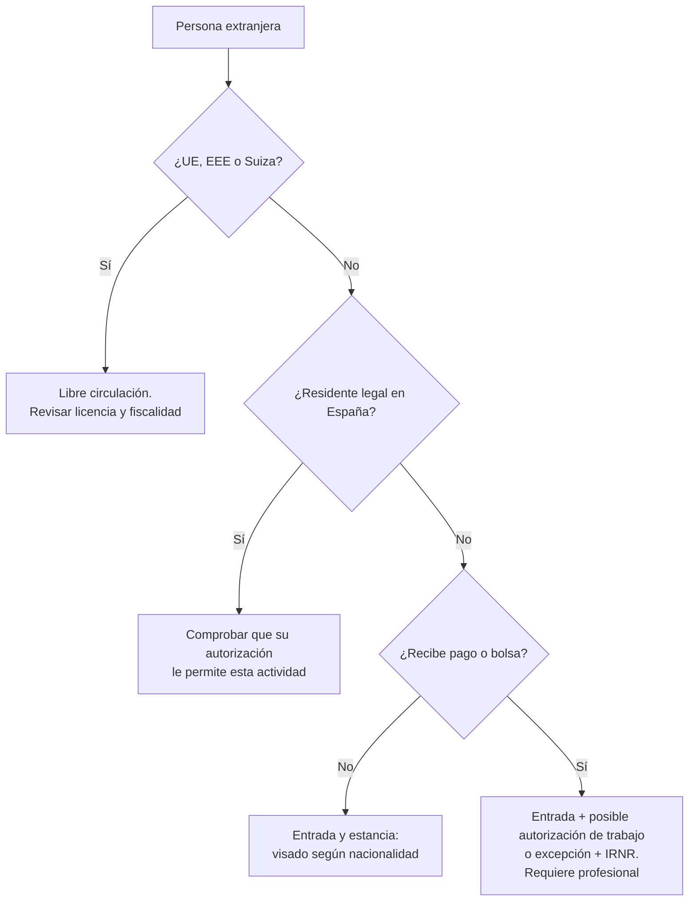

# Deportistas extranjeros

*Cuatro preguntas que no se responden entre sí: ¿puede entrar?, ¿puede trabajar?, ¿puede competir?, ¿cómo se le paga?*

## Antes de empezar (versión rápida)

- **Entrar, trabajar, competir y cobrar son controles distintos.** Una invitación deportiva no resuelve la entrada ni el trabajo, y una licencia no sustituye un visado. **[Obligación legal]**
- **Los ciudadanos de la UE, el EEE y Suiza** tienen libre circulación y un régimen muy distinto al de terceros países. **[Obligación legal]**
- **Si pagas a un deportista no residente por actuar en España, esa renta tributa en España** y quien paga tiene, en general, obligación de retener. El tipo general es del 24 % y del 19 % para residentes en la UE y el EEE con intercambio de información, salvo lo que diga un convenio. **[Obligación legal]**
- **El reglamento de extranjería vigente es el RD 1155/2024**, en vigor desde el 20 de mayo de 2025. **[Obligación legal]**

## 1. Qué resuelve esta guía

Te ayuda a identificar qué hay que resolver para cada deportista, técnico o árbitro extranjero, en qué orden y con quién. No sustituye el asesoramiento en extranjería ni en fiscalidad internacional, que en casi todos los casos con tercer país y pago es imprescindible.

## 2. La decisión que tienes que tomar

**Para cada persona: nacionalidad, residencia, duración, actividad y pago.** Con esas cinco respuestas se sabe qué régimen aplica.

## 3. El marco que se aplica

| Norma | Qué establece | Nivel |
| --- | --- | --- |
| **LO 4/2000 de extranjería** | Entrada, estancia, residencia y trabajo de extranjeros no UE; supuestos exceptuados de autorización de trabajo (art. 41) | [Obligación legal] |
| **RD 1155/2024 (Reglamento de extranjería)** | Desarrollo de la LO 4/2000; procedimientos; en vigor desde el 20/05/2025 | [Obligación legal] |
| **Régimen de ciudadanos UE / EEE / Suiza** | Libre circulación | [Obligación legal] |
| **Normativa de visados (Schengen)** | Estancias de corta duración según nacionalidad | [Obligación legal] |
| **RD 1006/1985** | Relación laboral especial de deportistas profesionales; exclusión de actuaciones aisladas | [Obligación legal] |
| **Impuesto sobre la Renta de No Residentes** | Tributación de rentas de deportistas por actuaciones en España; retención por el pagador; convenios para evitar la doble imposición | [Obligación legal] |
| **Reglas federativas** | Licencia, elegibilidad, cupos, autorizaciones de federaciones extranjeras | [Requisito federativo] |

## 4. Árbol de decisión

*Plantilla de trabajo KOMBAX*

## 5. Procedimiento

1. **Identifica** nacionalidad, residencia, duración de la estancia y actividad (competir, dar un seminario, arbitrar).
2. **Define el pago:** bolsa, premio, honorarios, dietas o gastos. Todo cuenta.
3. **Entrada:** consulta en las hojas informativas del Ministerio y en el consulado los requisitos de visado para su nacionalidad. **[Obligación legal]** Empieza con tiempo (C1: T-60 o antes).
4. **Trabajo:** si hay pago y no es ciudadano UE, valora con un profesional si hace falta autorización de trabajo o si hay una excepción aplicable. **[Requiere profesional]**
5. **Licencia y elegibilidad:** con la federación española y, si procede, la de su país. **[Requisito federativo]**
6. **Seguro:** asistencia sanitaria y accidentes durante la estancia (B3).
7. **Fiscalidad:** retención del Impuesto sobre la Renta de No Residentes sobre lo que pagues, salvo lo que diga un convenio (y con el certificado de residencia fiscal que proceda). **[Obligación legal]** / **[Requiere profesional]**
8. **Documenta:** carta de invitación coherente con la realidad, contrato, justificantes de pago y de retención.

## 6. Errores frecuentes

- **"Viene como invitado"** cuando en realidad cobra.
- **Cartas de invitación que dicen "turismo"** para una persona que viene a competir o a dar un seminario remunerado.
- **Pagar en efectivo sin retención.**
- **Pensar que la licencia federativa sirve de visado.**
- **Empezar los trámites dos semanas antes.**

## 7. Caso práctico

*Supongamos que* un luchador tailandés viene cuatro días a dar un seminario remunerado y a pelear en una velada con bolsa.

- **Entrada:** requisitos de visado según su nacionalidad (hoja informativa y consulado).
- **Trabajo:** hay pago por seminario y por combate; hay que valorar con un profesional si necesita autorización o si hay excepción.
- **Fiscalidad:** la bolsa y los honorarios tributan en España como rentas de no residente; el organizador retiene salvo convenio.
- **Deporte:** licencia o autorización para competir según la federación.
- **Documentos:** carta de invitación veraz, contrato y justificante de retención.

## 8. Checklist por persona

*Plantilla de trabajo KOMBAX*

| Campo | Comprobado |
| --- | --- |
| Nacionalidad y residencia | ☐ |
| Duración de la estancia y actividad | ☐ |
| Pago (tipo e importe) | ☐ |
| Entrada / visado | ☐ |
| Autorización de trabajo o excepción (con profesional) | ☐ |
| Licencia y elegibilidad | ☐ |
| Seguro | ☐ |
| Retención IRNR y convenio | ☐ |
| Contrato y carta de invitación | ☐ |

## 9. Qué cambia según el territorio

Muy poco: la extranjería y la fiscalidad de no residentes son estatales. Pueden cambiar las licencias autonómicas y los requisitos de la federación territorial.

## 10. Cuándo pedir ayuda

Siempre que haya una persona de fuera de la UE que cobre, estancias de más de 90 días, contratos profesionales o eventos internacionales.

## 11. Fuentes comentadas

- **RD 1155/2024** (entrada en vigor el 20/05/2025). [BOE](https://www.boe.es/buscar/act.php?id=BOE-A-2024-24099)
- **LO 4/2000.** [BOE](https://www.boe.es/buscar/act.php?id=BOE-A-2000-544)
- **Hojas informativas de extranjería.** [Ministerio de Inclusión](https://www.inclusion.gob.es/es/web/migraciones/hojas-informativas)
- **Agencia Tributaria — Tributación de artistas y deportistas no residentes** (nota de 28/03/2023: tipos del 24 % y 19 %, retención por el pagador, convenios). [AEAT](https://sede.agenciatributaria.gob.es/static_files/Sede/Tema/Normativa/Doctrina_Criterios/Criterios/No_Residentes/Artista_deportista_No_residntes.pdf)
- **RD 1006/1985.** [BOE](https://www.boe.es/buscar/act.php?id=BOE-A-1985-12313)

## 12. Verificado hasta y comprueba justo antes de actuar

**Verificado hasta:** 22/09/2026. **Comprueba:** las hojas informativas del Ministerio, los requisitos de visado de la nacionalidad concreta, el convenio de doble imposición aplicable y los criterios de la AEAT.

---
*KOMBAX Guías · C7 · Verificado hasta 22/09/2026 · Información general; no sustituye asesoramiento profesional individualizado.*
